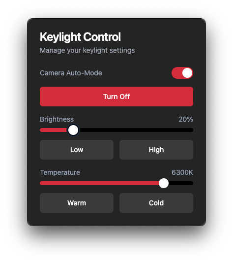

# Keylight Control

A sleek desktop application to control your Elgato Key Light. Features automatic camera-based control and a modern user interface.



## Features

- 🎥 Camera-based auto-mode: automatically controls your Key Light based on camera usage
- 💡 Manual brightness control with presets
- 🎨 Clean, modern dark interface
- 💾 Persists settings between sessions
- 🖥️ Native desktop app for macOS (Apple Silicon & Intel)

## Installation

Download the latest version from the [Releases](https://github.com/netoabel/keylight-control/releases) page.

### Requirements

- macOS 10.13 or later
- Elgato Key Light connected to your network

## Development

```bash
# Clone the repository
git clone https://github.com/netoabel/keylight-control.git
cd keylight-control

# Install dependencies
npm install

# Start development server
npm run electron:dev

# Build for production
npm run electron:build
```

### Tech Stack

- Electron
- React
- TypeScript
- Tailwind CSS
- Radix UI

## License

MIT © [Abel Neto](https://github.com/netoabel)
