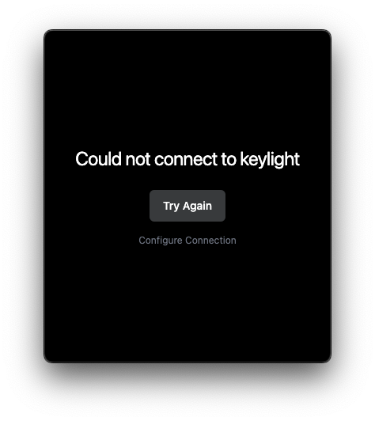
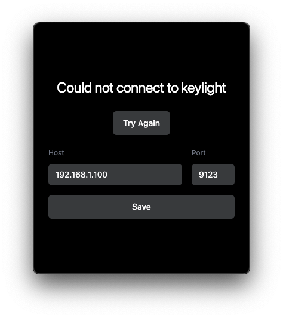

# Keylight Control

A sleek desktop application to control your Elgato Key Light. Features automatic camera-based control.


## Features

- 🎥 Camera-based auto-mode: automatically controls your Key Light based on camera usage
- 💡 Manual brightness control with customizable presets
- 🌡️ Color temperature control with customizable presets
- 🖥️ Native desktop app for macOS (Apple Silicon & Intel)

## Installation

1. Download the [latest version](https://github.com/netoabel/keylight-control/releases/latest)

2. After installing, open Terminal and run:

```bash
xattr -cr /Applications/keylight-control.app
```

3. Open the app and enjoy!

### Requirements

- macOS 10.13 or later
- Elgato Key Light connected to your network

## Usage

### Connection Settings

By default, the app tries to connect to your Key Light at `elgato-key-light-air-ec6e.local:9123`. If this doesn't work:



1. Click "Configure Connection" on the connection error screen
2. Enter your Key Light's IP address (e.g., `192.168.1.100`)
3. Enter the port (default is `9123`)
4. Click Save to apply and retry the connection



To find your Key Light's IP address:

- Open the Elgato Control Center app
- Select your Key Light
- Click the settings icon (⚙️)
- Look for the "IP Address" field

### Camera Auto-Mode

When enabled, the app automatically controls your Key Light based on camera usage:

- Light turns on when any app starts using your camera
- Light turns off when all apps stop using your camera
- Manual controls still work while auto-mode is enabled
- Your last used brightness and temperature settings are preserved

### Presets

The app includes customizable presets for both brightness and color temperature:

#### Brightness Presets (Low/High)

- Click a preset button to apply its brightness value
- Long press a preset button to save the current brightness as the new preset value
- Note: High preset must be brighter than Low preset

#### Temperature Presets (Warm/Cold)

- Click a preset button to apply its temperature value
- Long press a preset button to save the current temperature as the new preset value
- Note: Cold preset must be cooler (higher Kelvin) than Warm preset

## Development

```bash
# Clone the repository
git clone https://github.com/netoabel/keylight-control.git
cd keylight-control

# Install dependencies
npm install

# Start development server
npm run electron:dev

# Build for production
npm run electron:build
```

## License

MIT © [Abel Neto](https://github.com/netoabel)
